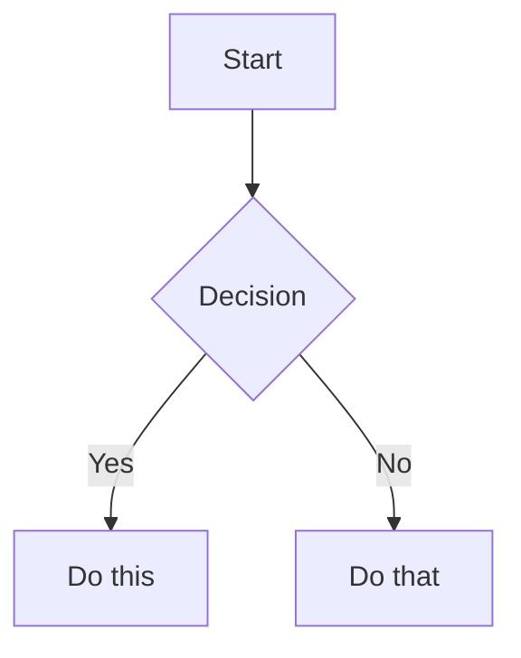

# Documentation Guide

This documentation is built with [MkDocs](https://www.mkdocs.org/) and the [Material theme](https://squidfunk.github.io/mkdocs-material/).

## Local Development

### Prerequisites

- Python 3.8 or higher
- pip (Python package manager)

### Setup

1. Install dependencies:
```bash
pip install -r requirements.txt
```

2. Start the development server:
```bash
mkdocs serve
```

3. Open your browser to `http://127.0.0.1:8000`

The development server will automatically reload when you make changes to the documentation files.

### Building Static Site

To build the static site:
```bash
mkdocs build
```

This creates a `site/` directory with the static HTML files.

## Writing Documentation

### Adding New Pages

1. Create a new `.md` file in the `docs/` directory
2. Add it to the `nav` section in `mkdocs.yml`

### Using Mermaid Diagrams

You can embed Mermaid diagrams directly in your markdown:

````markdown

````

### Deployment

Documentation is automatically deployed to GitHub Pages when changes are merged to the `main` branch via GitHub Actions.

Pull requests will trigger a build check to ensure the documentation builds successfully.