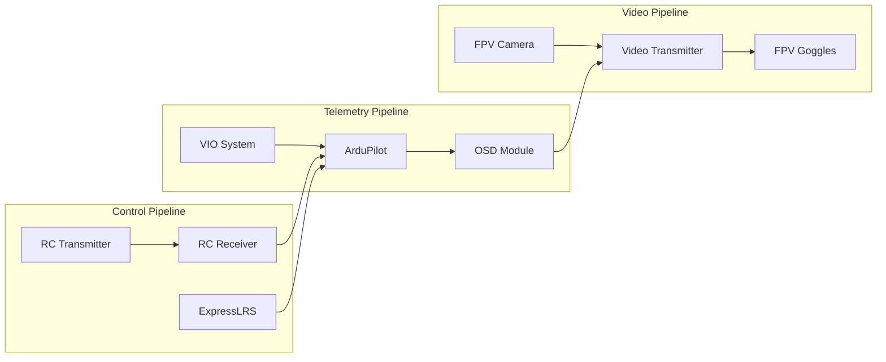

# ArduPilot FPV Configuration for VIO System

## Overview

This document provides detailed configuration for integrating FPV systems with ArduPilot and Visual Inertial Odometry, optimized for the Holybro X650x platform.

## FPV System Architecture



## Supported FPV Systems

### 1. DJI FPV System (Digital)
```bash
# ArduPilot parameters for DJI FPV
param set SERIAL2_PROTOCOL 33     # DJI FPV protocol
param set SERIAL2_BAUD 115        # 115200 baud
param set OSD_TYPE 5              # DJI OSD

# MSP telemetry configuration
param set MSP_OPTIONS 0           # Enable all MSP features
param set OSD1_ENABLE 1           # Enable OSD screen 1
```

### 2. HDZero/SharkByte (Digital)
```bash
# ArduPilot parameters for HDZero
param set SERIAL2_PROTOCOL 42     # MSP DisplayPort
param set SERIAL2_BAUD 115        # 115200 baud
param set OSD_TYPE 3              # MSP OSD

# Canvas configuration for HD
param set OSD_W_RSSI 1            # RSSI widget
param set OSD_W_VOLTAGE 1         # Battery voltage
param set OSD_W_CURRENT 1         # Current draw
param set OSD_W_BATUSED 1         # mAh consumed
```

### 3. Analog FPV with Betaflight OSD
```bash
# ArduPilot parameters for analog OSD
param set SERIAL2_PROTOCOL 10     # MAVLink2
param set SERIAL2_BAUD 57         # 57600 baud
param set OSD_TYPE 1              # MAX7456 analog OSD

# Analog OSD chip configuration
param set OSD_CS_PIN 8            # Chip select pin
param set OSD_UNITS 0             # Metric units
```

## VIO Status on OSD

### Custom OSD Elements for VIO
```python
class VIOOSDTelemetry:
    def __init__(self, mav_connection):
        self.mav = mav_connection
        self.setup_osd_screens()
    
    def setup_osd_screens(self):
        """Configure OSD screens with VIO information"""
        # Screen 1: Flight mode with VIO status
        osd_config = {
            'OSD1_MESSAGE_EN': 1,      # Enable messages
            'OSD1_MESSAGE_X': 2,       # X position
            'OSD1_MESSAGE_Y': 14,      # Y position
            
            # VIO confidence indicator
            'OSD1_PLUSCODE_EN': 1,     # Repurpose for VIO status
            'OSD1_PLUSCODE_X': 25,
            'OSD1_PLUSCODE_Y': 1,
            
            # Feature count display
            'OSD1_CLIMBEFF_EN': 1,     # Repurpose for feature count
            'OSD1_CLIMBEFF_X': 25,
            'OSD1_CLIMBEFF_Y': 2,
            
            # Standard telemetry
            'OSD1_ALTITUDE_EN': 1,
            'OSD1_ALTITUDE_X': 23,
            'OSD1_ALTITUDE_Y': 7,
            
            'OSD1_GSPEED_EN': 1,
            'OSD1_GSPEED_X': 2,
            'OSD1_GSPEED_Y': 13,
            
            'OSD1_HORIZON_EN': 1,      # Artificial horizon
            'OSD1_HORIZON_X': 14,
            'OSD1_HORIZON_Y': 8,
        }
        
        for param, value in osd_config.items():
            self.set_param(param, value)
    
    def send_vio_status(self, confidence, feature_count, processing_ms):
        """Send VIO status as OSD messages"""
        # Send as status text for message area
        status = "VIO: "
        if confidence > 0.8:
            status += "GOOD"
        elif confidence > 0.5:
            status += "FAIR"
        else:
            status += "POOR"
        
        self.mav.mav.statustext_send(
            mavutil.mavlink.MAV_SEVERITY_INFO,
            status.encode('utf-8')
        )
        
        # Send feature count as named float
        self.mav.mav.named_value_float_send(
            int(time.time() * 1e6),
            b'VIO_FEAT',
            float(feature_count)
        )
```

## ExpressLRS Integration

### ELRS Configuration for Low Latency
```bash
# ArduPilot RC configuration for ELRS
param set RC_PROTOCOLS 512        # CRSF protocol
param set SERIAL4_PROTOCOL 23     # RCIN
param set SERIAL4_BAUD 420        # 420000 baud for CRSF
param set SERIAL4_OPTIONS 0       # No inversion

# ELRS telemetry ratio
param set RC_OPTIONS 896          # Enable CRSF telemetry
param set SCHED_LOOP_RATE 800     # 800Hz loop rate

# Failsafe configuration
param set FS_THR_ENABLE 1         # Throttle failsafe
param set FS_THR_VALUE 975        # Failsafe PWM value
param set FS_GCS_ENABLE 1         # GCS failsafe
param set FS_EKF_ACTION 1         # Land on EKF failure
```

### ELRS Lua Script for VIO Monitoring
```lua
-- ELRS Lua script for VIO telemetry
local function getVIOStatus()
    local confidence = getValue("VIO_CONF")
    local features = getValue("VIO_FEAT")
    
    if confidence > 0.8 then
        return "VIO: OK", 0  -- Green
    elseif confidence > 0.5 then
        return "VIO: WARN", 2  -- Yellow
    else
        return "VIO: FAIL", 1  -- Red
    end
end

local function run(event)
    lcd.clear()
    
    -- Display VIO status
    local status, color = getVIOStatus()
    lcd.drawText(1, 1, status, color)
    
    -- Display feature count
    local features = getValue("VIO_FEAT")
    lcd.drawText(1, 10, "Features: " .. features)
    
    -- Display position confidence
    local conf = getValue("VIO_CONF") * 100
    lcd.drawText(1, 20, "Conf: " .. string.format("%.1f%%", conf))
    
    return 0
end

return { run=run }
```

## Low Latency Video Configuration

### Camera Settings for FPV
```python
# FPV camera configuration for low latency
fpv_camera_config = {
    'device': '/dev/video4',        # Dedicated FPV camera
    'resolution': (1280, 720),      # 720p for digital systems
    'fps': 60,                      # 60fps for smooth video
    'format': 'MJPG',               # Hardware compression
    'buffer_count': 1,              # Minimal buffering
    'exposure_mode': 'sports',      # Fast exposure
    'white_balance': 'fixed',       # Disable auto WB
}

class FPVCamera:
    def __init__(self, config):
        self.cap = cv2.VideoCapture(config['device'], cv2.CAP_V4L2)
        
        # Set low latency mode
        self.cap.set(cv2.CAP_PROP_BUFFERSIZE, config['buffer_count'])
        self.cap.set(cv2.CAP_PROP_FPS, config['fps'])
        self.cap.set(cv2.CAP_PROP_FOURCC, cv2.VideoWriter_fourcc(*'MJPG'))
        
        # Disable auto exposure for consistent latency
        self.cap.set(cv2.CAP_PROP_AUTO_EXPOSURE, 1)  # Manual mode
        self.cap.set(cv2.CAP_PROP_EXPOSURE, 100)      # Fixed exposure
```

### Video Pipeline Optimization
```bash
# GStreamer pipeline for minimal latency streaming
gst-launch-1.0 \
    v4l2src device=/dev/video4 ! \
    video/x-raw,width=1280,height=720,framerate=60/1 ! \
    videoconvert ! \
    x264enc tune=zerolatency bitrate=8000 speed-preset=ultrafast ! \
    rtph264pay config-interval=1 pt=96 ! \
    udpsink host=192.168.1.100 port=5600 sync=false
```

## ArduPilot Tuning for FPV Flight

### Rate Controller Tuning
```bash
# Aggressive rates for FPV acrobatics
param set ATC_RAT_RLL_P 0.135    # Roll rate P
param set ATC_RAT_RLL_I 0.135    # Roll rate I
param set ATC_RAT_RLL_D 0.0036   # Roll rate D
param set ATC_RAT_RLL_IMAX 0.5   # Roll rate I max

param set ATC_RAT_PIT_P 0.135    # Pitch rate P
param set ATC_RAT_PIT_I 0.135    # Pitch rate I
param set ATC_RAT_PIT_D 0.0036   # Pitch rate D

param set ATC_RAT_YAW_P 0.18     # Yaw rate P
param set ATC_RAT_YAW_I 0.018    # Yaw rate I

# Acro mode settings
param set ACRO_YAW_P 4.5         # Yaw acrobatic response
param set ACRO_RP_P 4.5          # Roll/Pitch acrobatic response
param set ACRO_RP_EXPO 0.3       # Expo for smoother center stick
param set ACRO_TRAINER 0         # Disable trainer (full acro)
```

### Flight Modes for FPV
```bash
# Recommended flight mode setup
param set FLTMODE1 2      # ACRO - Full manual
param set FLTMODE2 0      # STABILIZE - Self-leveling
param set FLTMODE3 5      # LOITER - GPS/VIO hold
param set FLTMODE4 6      # RTL - Return to launch
param set FLTMODE5 17     # POSHOLD - VIO position hold
param set FLTMODE6 3      # AUTO - Autonomous with VIO

# Switch configuration (3-position switch)
param set FLTMODE_CH 5    # Flight mode channel
param set RC5_MIN 1000    # Minimum PWM
param set RC5_MAX 2000    # Maximum PWM
```

## Companion Computer Integration

### Real-time Video Processing
```python
import threading
import queue
import numpy as np
from dataclasses import dataclass
import time

@dataclass
class FPVFrame:
    image: np.ndarray
    timestamp: float
    telemetry: dict

class FPVProcessor:
    def __init__(self, enable_osd_overlay=True):
        self.frame_queue = queue.Queue(maxsize=2)  # Small queue for low latency
        self.enable_osd = enable_osd_overlay
        self.vio_status = {}
        
    def process_frame(self, frame: FPVFrame):
        """Process FPV frame with minimal latency"""
        if self.enable_osd:
            frame.image = self.add_vio_overlay(frame.image)
        
        # Priority queue - drop old frames if behind
        if self.frame_queue.full():
            try:
                self.frame_queue.get_nowait()  # Drop oldest frame
            except queue.Empty:
                pass
        
        self.frame_queue.put_nowait(frame)
    
    def add_vio_overlay(self, image):
        """Add VIO status overlay to FPV feed"""
        height, width = image.shape[:2]
        
        # VIO confidence bar
        conf = self.vio_status.get('confidence', 0)
        bar_width = int(width * 0.2)
        bar_height = 10
        bar_x = width - bar_width - 10
        bar_y = 10
        
        # Color based on confidence
        if conf > 0.8:
            color = (0, 255, 0)  # Green
        elif conf > 0.5:
            color = (0, 255, 255)  # Yellow
        else:
            color = (0, 0, 255)  # Red
        
        # Draw confidence bar
        cv2.rectangle(image, (bar_x, bar_y), 
                     (bar_x + int(bar_width * conf), bar_y + bar_height),
                     color, -1)
        cv2.rectangle(image, (bar_x, bar_y),
                     (bar_x + bar_width, bar_y + bar_height),
                     (255, 255, 255), 1)
        
        # Add text overlay
        cv2.putText(image, f"VIO: {conf:.0%}", 
                   (bar_x, bar_y - 5),
                   cv2.FONT_HERSHEY_SIMPLEX, 0.5, (255, 255, 255), 1)
        
        # Feature count
        features = self.vio_status.get('feature_count', 0)
        cv2.putText(image, f"Features: {features}", 
                   (10, height - 20),
                   cv2.FONT_HERSHEY_SIMPLEX, 0.5, (255, 255, 255), 1)
        
        return image
```

## Network Configuration for FPV

### WiFi Settings for Digital FPV
```bash
# Configure 5GHz WiFi for video streaming
sudo nmcli device wifi hotspot \
    ifname wlan0 \
    ssid "DRONE_FPV" \
    band a \
    channel 149 \
    password "fpvpassword"

# Optimize WiFi for low latency
sudo iw reg set US
sudo iw dev wlan0 set power_save off
sudo iw dev wlan0 set txpower fixed 3000  # 30dBm

# QoS for video priority
sudo tc qdisc add dev wlan0 root handle 1: htb default 30
sudo tc class add dev wlan0 parent 1: classid 1:1 htb rate 40mbit
sudo tc class add dev wlan0 parent 1:1 classid 1:10 htb rate 30mbit prio 1  # Video
sudo tc class add dev wlan0 parent 1:1 classid 1:30 htb rate 10mbit prio 2  # Telemetry
```

## Troubleshooting

### Common FPV Issues

1. **High Video Latency**
   - Reduce camera resolution or framerate
   - Disable video stabilization
   - Use hardware encoding (V4L2 H.264)
   - Minimize buffering in pipeline

2. **OSD Flickering**
   - Check OSD chip SPI connection
   - Verify OSD_TYPE parameter
   - Update OSD firmware

3. **VIO Status Not Showing**
   - Verify MAVLink message routing
   - Check named value float messages
   - Ensure proper SERIAL configuration

4. **ELRS Connection Issues**
   - Verify SERIAL baud rate (420000)
   - Check CRSF protocol selection
   - Update ELRS firmware to latest

## Performance Metrics

### Expected Latencies
- Glass-to-glass video: 20-40ms (digital), 10-20ms (analog)
- VIO to OSD update: <50ms
- RC control: 5-10ms (ELRS 500Hz)
- Total system latency: <100ms

### Bandwidth Requirements
- FPV video stream: 8-15 Mbps (720p60)
- Telemetry: 50-100 Kbps
- VIO data: 10-20 Kbps
- Total: ~15 Mbps sustained