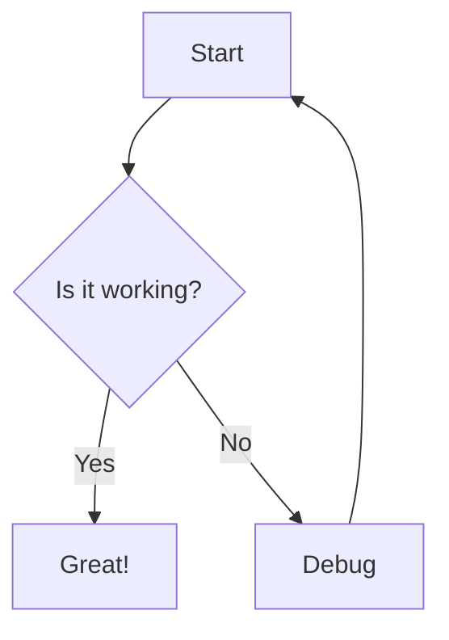

# VIO Documentation

Welcome to the VIO project documentation.

## Quick Start

This documentation site is built with MkDocs and supports Mermaid diagrams.

## Example Mermaid Diagram

## Available Pages

- [Research](research.md) - Research documentation and notes
- [Architecture](vio-architecture-doc.md) - VIO system architecture documentation