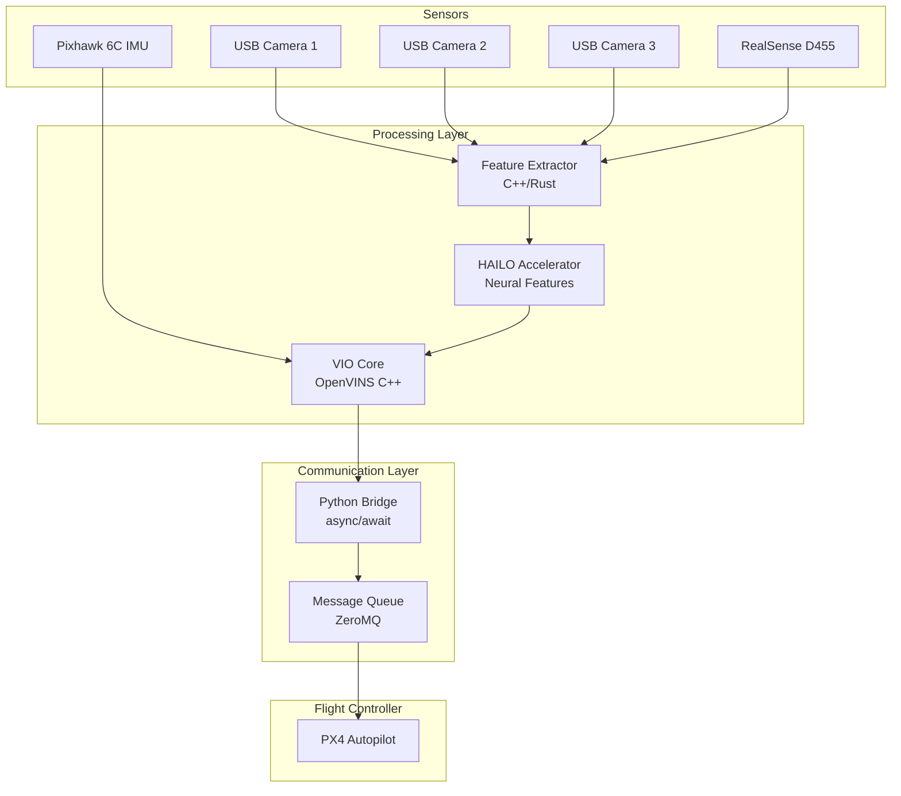

# VIO System Architecture

## Overview

A simplified Visual Inertial Odometry system for the Holybro X650x drone, designed for modularity and performance.

## System Components



## Core Design Principles

1. **Simplicity First** - Avoid over-engineering, use proven solutions
2. **Language Separation** - Python for I/O and communication, C++/Rust for compute
3. **Modular Design** - Each component does one thing well
4. **Async Communication** - Non-blocking message passing between components

## Component Details

### 1. Sensor Input Layer

**Camera Configuration**
- 4 cameras total (3 USB + 1 RealSense D455)
- 640x480 @ 20 FPS per camera (manageable USB bandwidth)
- Software synchronization with 10ms tolerance

**IMU Data**
- Direct feed from Pixhawk 6C at 200Hz
- Simple low-pass filtering for vibration

### 2. Feature Extraction (C++/Rust)

**Primary Implementation: Rust**
```rust
// Simple feature extraction pipeline
pub struct FeatureExtractor {
    detector: Box<dyn FeatureDetector>,
    cameras: Vec<Camera>,
}

impl FeatureExtractor {
    pub fn extract(&mut self, frames: &[Frame]) -> Features {
        frames.par_iter()
            .map(|frame| self.detector.detect(frame))
            .collect()
    }
}
```

**HAILO Acceleration**
- SuperPoint neural features for robust detection
- Offload only feature detection to HAILO
- Keep descriptor matching on CPU for flexibility

### 3. VIO Core (C++)

**OpenVINS Configuration**
- Multi-camera MSCKF formulation
- Minimal configuration, rely on defaults
- Output: 6DOF pose at 20Hz

```cpp
// Simplified VIO interface
class VIOSystem {
public:
    void processIMU(const ImuData& imu);
    void processFeatures(const Features& features);
    Pose getPose() const;
    bool isHealthy() const;
};
```

### 4. Python Communication Bridge

**Architecture**
```python
import asyncio
import zmq.asyncio
import numpy as np
from dataclasses import dataclass

@dataclass
class VIOPose:
    position: np.ndarray  # [x, y, z]
    orientation: np.ndarray  # quaternion [w, x, y, z]
    timestamp: float
    confidence: float

class VIOBridge:
    def __init__(self):
        self.context = zmq.asyncio.Context()
        self.vio_socket = self.context.socket(zmq.SUB)
        self.px4_socket = self.context.socket(zmq.PUB)
        
    async def run(self):
        """Main communication loop"""
        while True:
            # Receive VIO pose
            pose_data = await self.vio_socket.recv_json()
            pose = self.parse_vio_pose(pose_data)
            
            # Transform to PX4 format
            px4_msg = self.to_px4_format(pose)
            
            # Send to flight controller
            await self.px4_socket.send_json(px4_msg)
            
    def to_px4_format(self, pose: VIOPose) -> dict:
        """Convert VIO pose to PX4 visual odometry message"""
        return {
            'timestamp': int(pose.timestamp * 1e6),
            'x': pose.position[0],
            'y': -pose.position[1],  # ROS to NED
            'z': -pose.position[2],
            'q': pose.orientation.tolist(),
            'confidence': pose.confidence
        }
```

### 5. Message Queue Architecture

**ZeroMQ for Inter-Process Communication**
- PUB/SUB pattern for sensor data
- REQ/REP pattern for control commands
- No complex middleware (no ROS if not needed)

```python
# Message flow configuration
ENDPOINTS = {
    'cameras': 'tcp://localhost:5555',
    'imu': 'tcp://localhost:5556',
    'vio_output': 'tcp://localhost:5557',
    'px4_bridge': 'tcp://localhost:5558'
}
```

## Deployment Strategy

### Process Separation

```yaml
# docker-compose.yml for development
version: '3.8'

services:
  camera_driver:
    build: ./camera_driver
    devices:
      - /dev/video0:/dev/video0
      - /dev/video1:/dev/video1
      - /dev/video2:/dev/video2
    command: python camera_capture.py
    
  vio_core:
    build: ./vio_core
    command: ./openvins_node
    
  px4_bridge:
    build: ./px4_bridge
    command: python bridge.py
    network_mode: host
```

### Resource Allocation

**Raspberry Pi 5 Core Assignment**
- Core 0: System and Python communication
- Core 1: Camera drivers
- Core 2-3: VIO computation

## Development Workflow

### 1. Start Simple
```bash
# Phase 1: Single camera + IMU
python test_single_camera.py

# Phase 2: Multi-camera synchronization
python test_multicam_sync.py

# Phase 3: Full VIO pipeline
./run_vio_system.sh
```

### 2. Testing Strategy
- Unit tests for each component
- Hardware-in-the-loop simulation with PX4 SITL
- Record and replay sensor data for debugging

### 3. Performance Monitoring
```python
# Simple performance tracker
class PerformanceMonitor:
    def __init__(self):
        self.metrics = {
            'fps': deque(maxlen=100),
            'latency': deque(maxlen=100),
            'cpu_usage': deque(maxlen=100)
        }
    
    def log_frame(self, processing_time):
        self.metrics['fps'].append(1.0 / processing_time)
        
    def get_stats(self):
        return {
            'avg_fps': np.mean(self.metrics['fps']),
            'p95_latency': np.percentile(self.metrics['latency'], 95),
            'cpu_usage': psutil.cpu_percent()
        }
```

## Configuration Files

### Camera Configuration
```yaml
# config/cameras.yaml
cameras:
  - id: 0
    device: /dev/video0
    resolution: [640, 480]
    fps: 20
    
  - id: 1
    device: /dev/video1
    resolution: [640, 480]
    fps: 20
    
  - id: 2
    device: /dev/video2
    resolution: [640, 480]
    fps: 20
    
  realsense:
    serial: "123456789"
    resolution: [640, 480]
    fps: 15
```

### VIO Parameters
```yaml
# config/vio.yaml
feature_tracking:
  max_features: 150
  quality_level: 0.01
  min_distance: 10
  
optimization:
  window_size: 10
  max_iterations: 5
  
imu:
  rate: 200
  accel_noise: 0.01
  gyro_noise: 0.001
```

## Quick Start Guide

### Prerequisites
```bash
# Install system dependencies
sudo apt update
sudo apt install -y build-essential cmake python3-pip libopencv-dev

# Python dependencies
pip install zmq numpy opencv-python asyncio dataclasses

# Build VIO core (C++)
cd vio_core
mkdir build && cd build
cmake .. && make -j4
```

### Running the System
```bash
# Terminal 1: Start camera drivers
python camera_driver/multi_camera.py

# Terminal 2: Start VIO core
./vio_core/build/vio_node

# Terminal 3: Start PX4 bridge
python px4_bridge/bridge.py

# Terminal 4: Monitor system
python tools/monitor.py
```

## Future Improvements

### Short Term
- [ ] Implement basic loop closure
- [ ] Add dynamic camera calibration
- [ ] Optimize HAILO model quantization

### Long Term
- [ ] Rust implementation of full VIO pipeline
- [ ] Edge deployment optimizations
- [ ] Multi-drone coordination support

## References

- [OpenVINS Documentation](https://docs.openvins.com/)
- [PX4 Visual Inertial Odometry](https://docs.px4.io/main/en/computer_vision/visual_inertial_odometry.html)
- [HAILO Developer Guide](https://hailo.ai/developer-zone/)